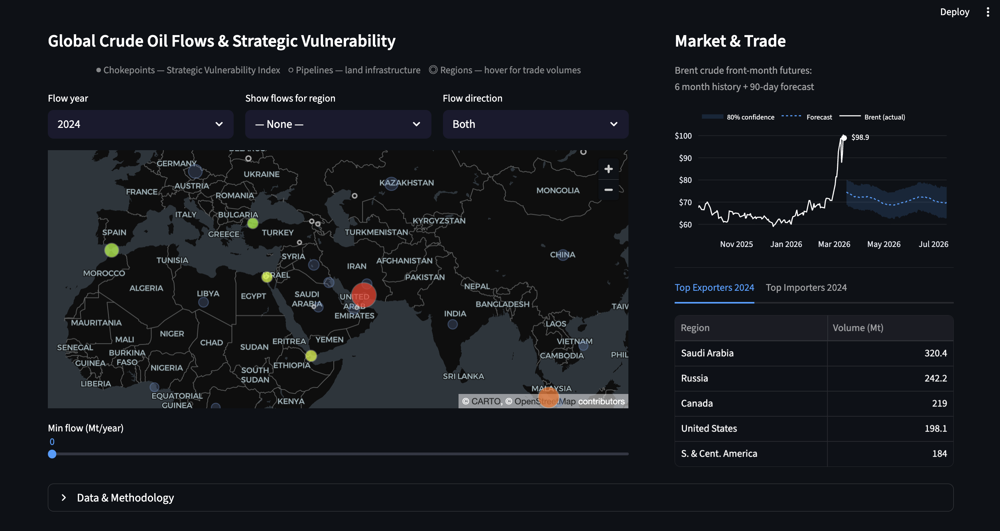
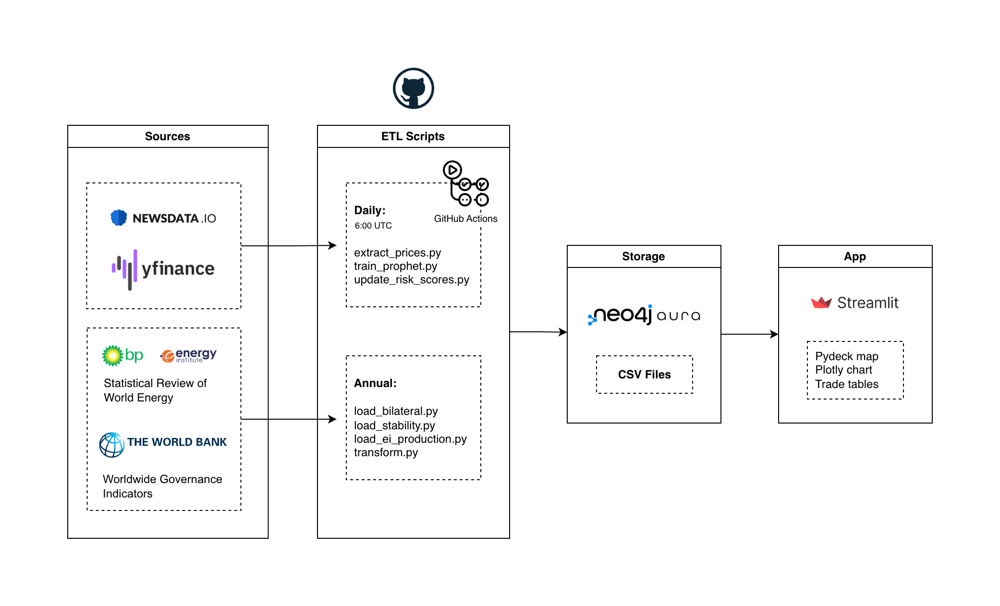

# Oil Flow Map
**Global Crude Oil Flows & Strategic Vulnerability Intelligence**

Interactive dashboard tracking global crude oil supply chains, maritime chokepoint strategic vulnerability, and Brent crude price forecasting — updated daily via automated pipeline.

---



**[Live app →](https://your-app.streamlit.app)**

---

## What it does

Visualises the global crude oil supply network and models the strategic vulnerability of key maritime chokepoints. Combines four years of bilateral trade flow data, World Bank political stability indices, and daily news sentiment into a **Strategic Vulnerability Index** — a measure of how consequential a disruption at each point would be for global oil supply.

---

## Architecture



| Layer | Components |
|---|---|
| Sources | Yahoo Finance · EI/BP Statistical Review · World Bank WGI · NewsData.io |
| ETL | Python scripts — static loaders (annual) + daily updaters |
| Storage | Neo4j Aura (graph DB) |
| App | Streamlit — Pydeck map · Plotly chart · trade tables |

GitHub Actions runs the daily pipeline at 06:00 UTC: fetch prices → retrain Prophet → update sentiment scores.

---

## Tech Stack

Neo4j · Python · pandas · Facebook Prophet · VADER · Pydeck · Plotly · Streamlit · GitHub Actions · Yahoo Finance

---

## Data Sources

| Dataset | Source | Frequency |
|---|---|---|
| Bilateral crude trade flows | EI / BP Statistical Review 2022–2025 | Annual |
| Political stability scores | World Bank WGI | Annual |
| Brent crude futures | Yahoo Finance (BZ=F) | Daily |
| News headlines | NewsData.io | Daily |

Bilateral flows were manually compiled from BP/EI Statistical Review trade matrices. Route assignments (which flows transit which chokepoint) are based on geographic reasoning — not measured vessel tracking data.

---

## Strategic Vulnerability Index

Measures **consequence severity if disruption occurs** — not probability of disruption.

```
SVI = 0.80 × flow_norm + 0.20 × instability_norm
```

Adjusted daily by news sentiment (20% weight). Pipelines are displayed as infrastructure context only.

---

## Known Limitations & Roadmap

**Current limitations:**

- **Flow routing is analytical judgment** — chokepoint flow assignments are based on geographic reasoning. Measured vessel tracking data (AIS) would replace this with ground truth
- **Regional aggregates** — bilateral flows are often region-to-region; country-pair granularity requires licensed trade data (S&P Global Commodity Insights, Kpler)
- **Prophet is a stable-conditions baseline** — the model captures trend and seasonality but cannot predict geopolitical shocks; the gap between actual and forecast price reflects the current risk premium
- **Sentiment history builds from deployment** — Prophet geopolitical regressor planned once 30 days of sentiment data accumulate
- **Pipelines are infrastructure markers only** — no flow data available on free sources; pipeline vulnerability scoring requires licensed capacity and utilisation data

**V2 with commercial data:**

- **AIS vessel tracking** — Terminal nodes and chokepoint routing relationships are already modelled in Neo4j, designed for integration with MarineTraffic or Lloyd's List vessel movement data
- **Country-pair trade flows** — Kpler or S&P Global Commodity Insights would replace regional aggregates with country-level granularity
- **Geopolitical risk indices** — ACLED conflict event data or Oxford Analytica risk scores as structured regressors for Prophet, replacing the news sentiment approximation
- **Country profile panel** — production and consumption data (EI 2024) already loaded; historical series can be extracted from annual BP/EI Statistical Review PDF reports using the same process as the bilateral flow data or sourced from commercial data
- **Time-series stability analysis** — StabilityScore nodes already in Neo4j, enable trend queries across years for a future analytics panel

---

## License

MIT


## Author
Aleksej Talstou  
[LinkedIn](https://www.linkedin.com/in/aliaxey-talstou/) | [GitHub](https://github.com/altal3000)